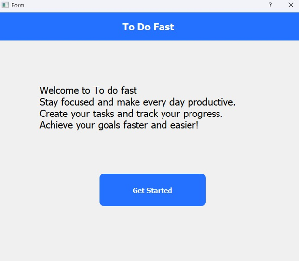
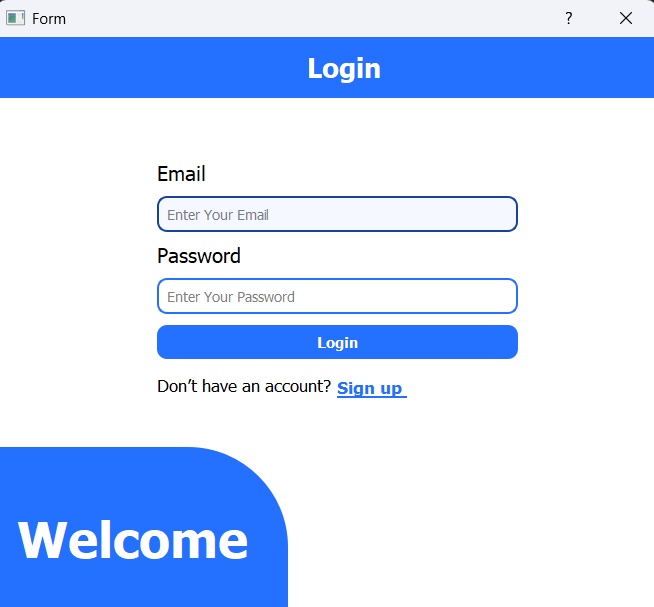
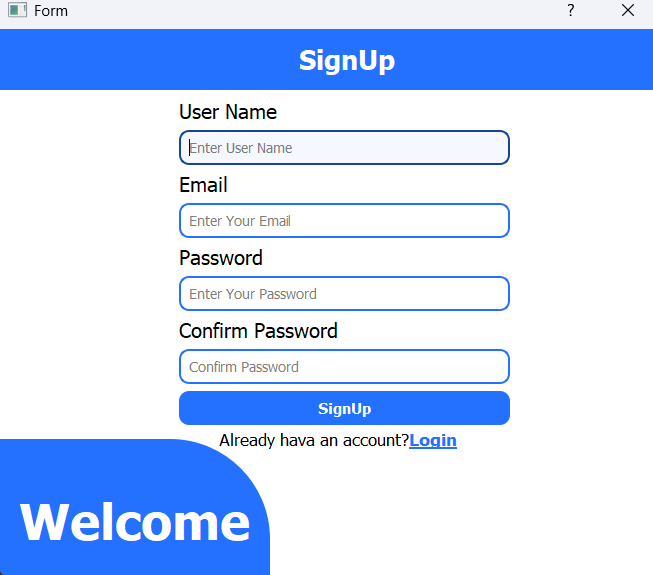
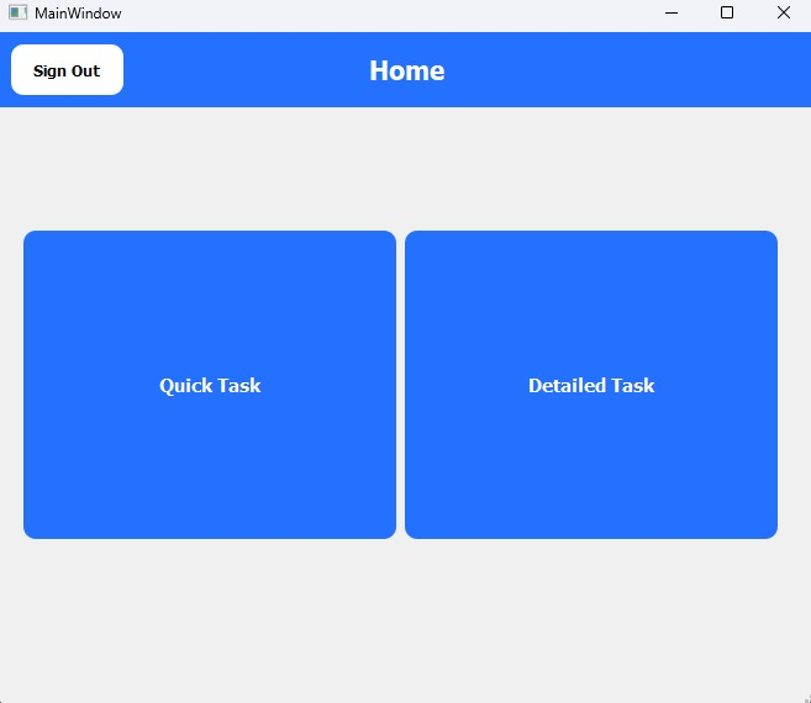
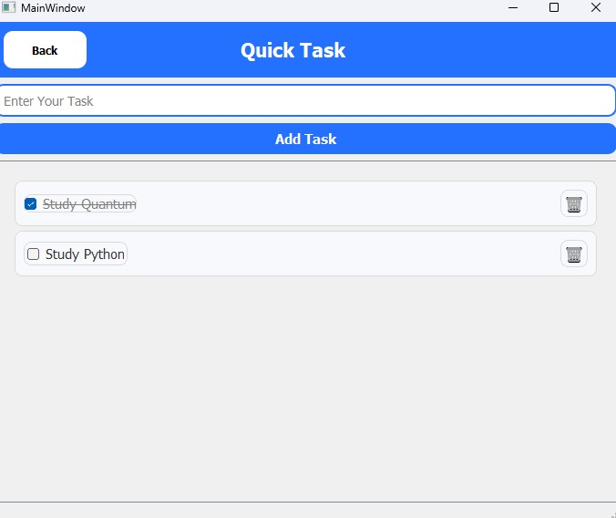
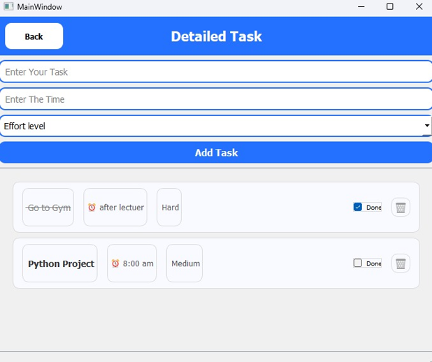

# Qt Task Management App

A simple desktop task management application built using Python, Qt Designer, and SQLite.  
The app allows users to manage daily tasks through a clean and user-friendly desktop interface.

---

## ✨ Features
- Add new tasks
- View tasks in a table-based interface
- Update and delete existing tasks
- Local data persistence using SQLite
- Simple and intuitive desktop UI

---

## 🛠 Tech Stack
- Python
- Qt (Qt Designer)
- SQLite

---

## 📸 Screenshots

<p align="center">
  
  
</p>

<p align="center">
  
  
</p>

<p align="center">
  
  
</p>


---

## 🚀 How to Run
1. Clone the repository:
   ```bash
   git clone https://github.com/AbdullahKhojah/Qt-todo-app.git
